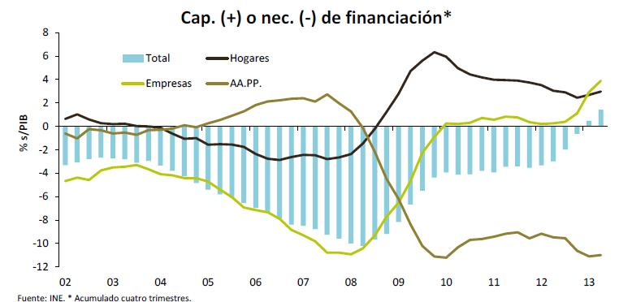
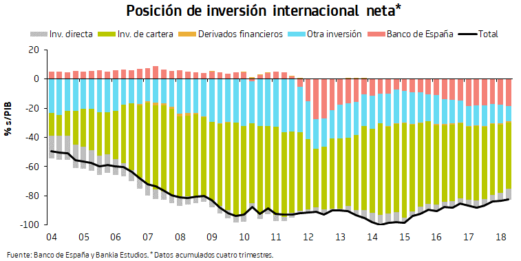

```{r setup, include=FALSE}
knitr::opts_chunk$set(echo = FALSE)
```


## Economías emergentes: ¿Qué son?

- No existe ninguna definición precisa

--

- ¿Pero que pensamos nosotros?

---

## Lazos comerciales

Una fracción no trivial del comercio internacional español es con países emergentes


---

## Lazos comerciales

Gran parte de la inversión española en el exterior está en economías emergentes


---

## Lazos financieros

Durante años las necesidades de financiación han sido cubiertas por el resto del mundo



---

## Lazos financieros

Durante años las necesidades de financiación han sido cubiertas por el resto del mundo



---

## Economías emergentes: Características

- Menor ingreso por persona

---

## Economías emergentes: Características

```{r librerias, echo = FALSE, warning=FALSE, message=FALSE}
if (! ('pacman' %in% installed.packages())) install.packages('pacman')

pacman::p_load(wbstats, IMFData, tidyverse, kableExtra)

```

```{r gdppc, warning=FALSE, message=FALSE, fig.align='center', fig.width=12}

new_cache <- wbcache()


#GDP per capita (World Bank data)

gdppc_data <- wb(indicator = 'NY.GDP.PCAP.CD', startdate = 1990, enddate = 2017)

gdppc_data %>% dplyr::filter(country %in% c("European Union", "Latin America & Caribbean",  "Sub-Saharan Africa",  "South Asia", "North America")) %>% 
  ggplot(aes(x=date,y=value, group=country, colour=country))+
  geom_line(size=1.6) + 
  labs(title = 'PIB per Cápita',
       x ='Año',
       y = 'PIB per cápita',
       caption = 'Fuente = Banco Mundial') +
  theme(legend.position = "bottom")+
  theme(axis.text.x=element_text(size=11,colour="#535353",face="bold")) +
  theme(axis.text.y=element_text(size=11,colour="#535353",face="bold")) +
  theme(axis.title.y=element_text(size=11,colour="#535353",face="bold",vjust=1.5)) +
  theme(axis.title.x=element_text(size=11,colour="#535353",face="bold",vjust=-.5))+
  theme(axis.text.x  = element_text(angle=90))+
  theme(plot.title=element_text(face="bold",hjust=0.5,vjust=2,colour="#3C3C3C",size=18))+
  theme(legend.title=element_blank())


```

---

## Economías emergentes: Características

- Menor ingreso por persona

--

- ¿Más desigualdad?

---

## Economías emergentes: Características

```{r gini, warning=FALSE, message=FALSE, fig.align='center', fig.width=12}

gini_data <- wb(indicator = 'SI.POV.GINI', startdate = 1990, enddate = 2017)

gini_data %>% dplyr::filter(country %in% c("Spain","Canada","Argentina","Thailand", "Rwanda")) %>%
  dplyr::filter(date>=2004) %>% 
  ggplot(aes(x=date,y=value, group=country, colour=country))+
  geom_line(size=1.6) + 
  labs(title = 'Desigualdad de ingresos',
       x ='Año',
       y = 'Indice de Gini',
       caption = 'Fuente = Banco Mundial') +
  theme(legend.position = "bottom")+
  theme(axis.text.x=element_text(size=11,colour="#535353",face="bold")) +
  theme(axis.text.y=element_text(size=11,colour="#535353",face="bold")) +
  theme(axis.title.y=element_text(size=11,colour="#535353",face="bold",vjust=1.5)) +
  theme(axis.title.x=element_text(size=11,colour="#535353",face="bold",vjust=-.5))+
  theme(axis.text.x  = element_text(angle=90))+
  theme(plot.title=element_text(face="bold",hjust=0.5,vjust=2,colour="#3C3C3C",size=18))+
  theme(legend.title=element_blank())

```

---

## Economías emergentes: Características

- Menor ingreso por persona

- ¿Más desigualdad?

--

- Peor calidad institucional

--

- Menor acceso a servicios públicos

--

- Menor nivel de desarrollo humano, etc.

---

## Economías emergentes: Características

Ahora nos concentramos en lo estrictamente <span style="color:red"> **ECONÓMICO** </span>
