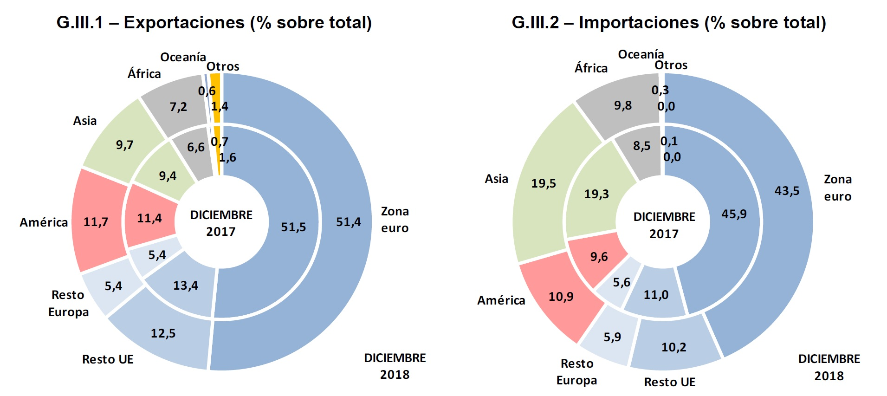
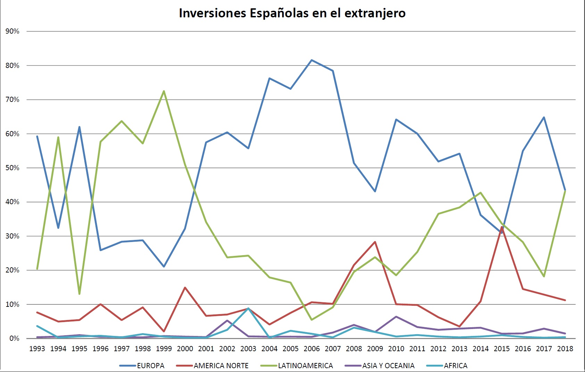
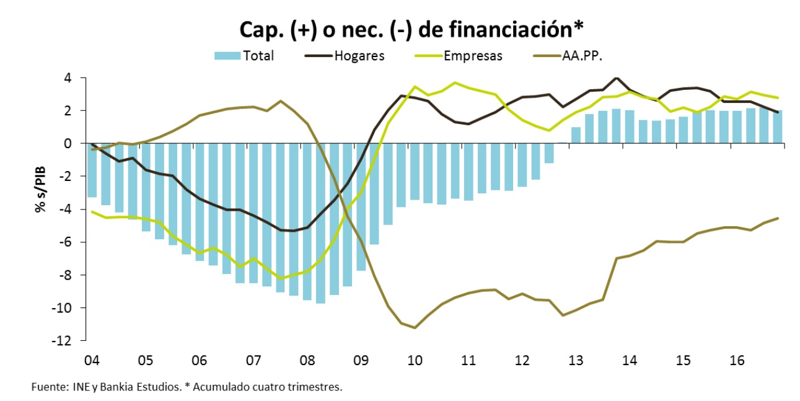
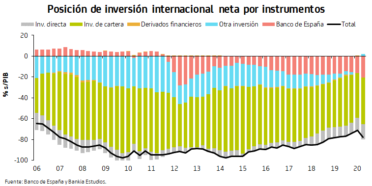
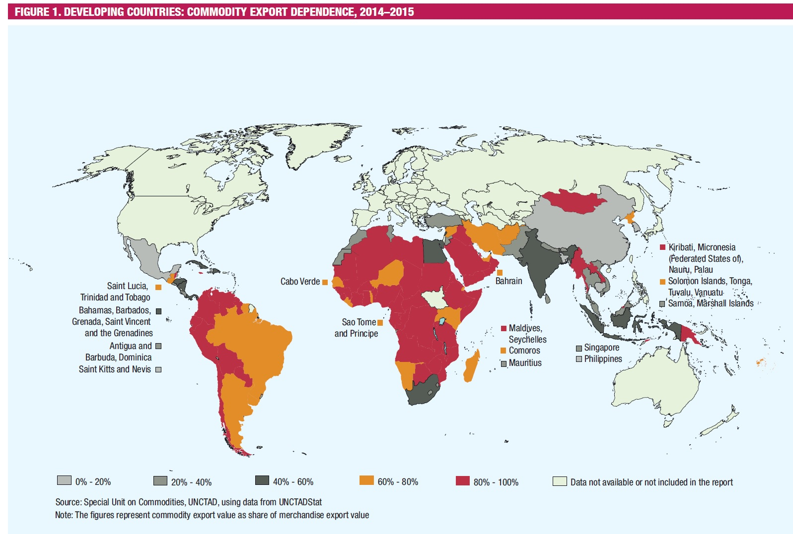
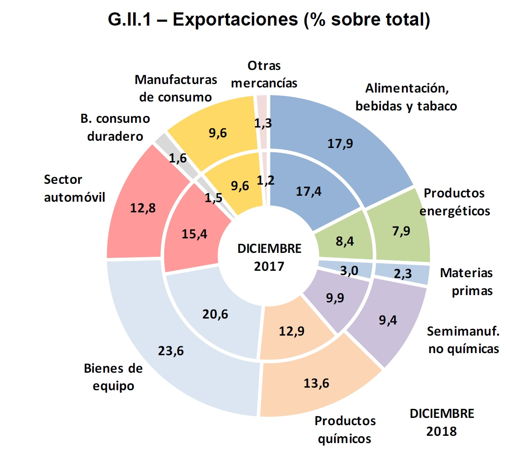
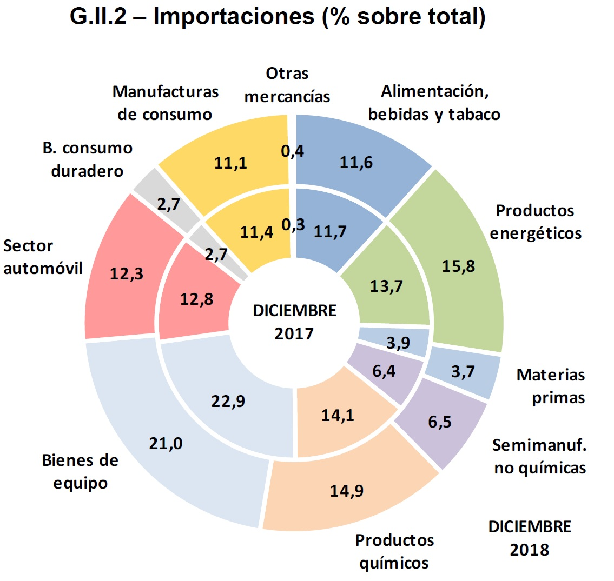
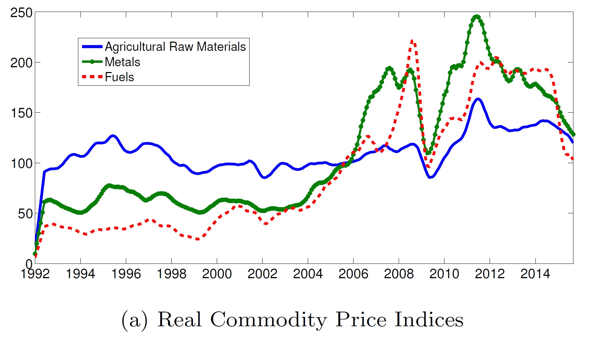
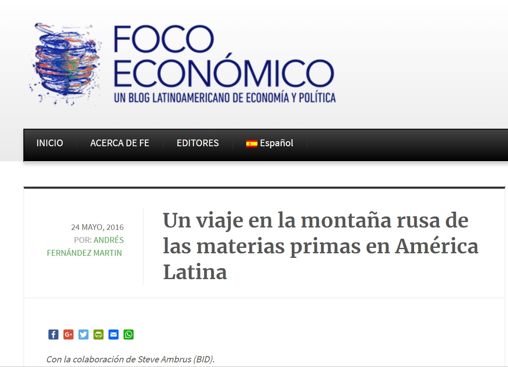

```{r setup, include=FALSE}
knitr::opts_chunk$set(echo = FALSE)
```


## Economías emergentes: ¿Qué son?

- No existe ninguna definición precisa

--

- ¿Pero que pensamos nosotros?

---

## Lazos comerciales

Una fracción no trivial del comercio internacional español es con países emergentes



---

## Lazos comerciales

Gran parte de la inversión española en el exterior está en economías emergentes



---

## Lazos financieros

Durante años las necesidades de financiación han sido cubiertas por el resto del mundo



---

## Lazos financieros

Durante años las necesidades de financiación han sido cubiertas por el resto del mundo



---

## Economías emergentes: Características

- Menor ingreso por persona

---

## Economías emergentes: Características

```{r librerias, echo = FALSE, warning=FALSE, message=FALSE}
if (! ('pacman' %in% installed.packages())) install.packages('pacman')

pacman::p_load(wbstats, IMFData, tidyverse, kableExtra)

```

```{r gdppc, warning=FALSE, message=FALSE, fig.align='center', fig.width=12}

new_cache <- wbcache()


#GDP per capita (World Bank data)

gdppc_data <- wb(indicator = 'NY.GDP.PCAP.CD', startdate = 1990, enddate = 2019)

gdppc_data %>% dplyr::filter(country %in% c("European Union", "Latin America & Caribbean",  "Sub-Saharan Africa",  "South Asia", "North America")) %>% 
  ggplot(aes(x=date,y=value, group=country, colour=country))+
  geom_line(size=1.6) + 
  labs(title = 'PIB per Cápita',
       x ='Año',
       y = 'PIB per cápita',
       caption = 'Fuente = Banco Mundial') +
  theme(legend.position = "bottom")+
  theme(axis.text.x=element_text(size=11,colour="#535353",face="bold")) +
  theme(axis.text.y=element_text(size=11,colour="#535353",face="bold")) +
  theme(axis.title.y=element_text(size=11,colour="#535353",face="bold",vjust=1.5)) +
  theme(axis.title.x=element_text(size=11,colour="#535353",face="bold",vjust=-.5))+
  theme(axis.text.x  = element_text(angle=90))+
  theme(plot.title=element_text(face="bold",hjust=0.5,vjust=2,colour="#3C3C3C",size=18))+
  theme(legend.title=element_blank())


```

---

## Economías emergentes: Características

- Menor ingreso por persona

--

- ¿Más desigualdad?

---

## Economías emergentes: Características

```{r gini, warning=FALSE, message=FALSE, fig.align='center', fig.width=12}

gini_data <- wb(indicator = 'SI.POV.GINI', startdate = 1990, enddate = 2019)

gini_data %>% dplyr::filter(country %in% c("Spain","Canada","Argentina","Thailand", "Rwanda")) %>%
  dplyr::filter(date>=2004) %>% 
  ggplot(aes(x=date,y=value, group=country, colour=country))+
  geom_line(size=1.6) + 
  labs(title = 'Desigualdad de ingresos',
       x ='Año',
       y = 'Indice de Gini',
       caption = 'Fuente = Banco Mundial') +
  theme(legend.position = "bottom")+
  theme(axis.text.x=element_text(size=11,colour="#535353",face="bold")) +
  theme(axis.text.y=element_text(size=11,colour="#535353",face="bold")) +
  theme(axis.title.y=element_text(size=11,colour="#535353",face="bold",vjust=1.5)) +
  theme(axis.title.x=element_text(size=11,colour="#535353",face="bold",vjust=-.5))+
  theme(axis.text.x  = element_text(angle=90))+
  theme(plot.title=element_text(face="bold",hjust=0.5,vjust=2,colour="#3C3C3C",size=18))+
  theme(legend.title=element_blank())

```

---

## Economías emergentes: Características

- Menor ingreso por persona

- ¿Más desigualdad?

--

- Peor calidad institucional

--

- Menor acceso a servicios públicos

--

- Menor nivel de desarrollo humano, etc.

---

## Economías emergentes: Características

Ahora nos concentramos en lo estrictamente <span style="color:red"> **ECONÓMICO** </span>

---

## Economías emergentes: Características

Las economías emergentes tienden a ser más <span style="color:blue"> *abiertas* </span>, es decir, el comercio internacional tiene un mayor peso en su economía.

```{r tradeGdp, warning=FALSE, message=FALSE, fig.align='center', fig.width=12}

tr_data <- wb(indicator = 'NE.TRD.GNFS.ZS', startdate = 1990, enddate = 2019)

tr_data %>% dplyr::filter(country %in% c("European Union",
                                         "North America",
                                         "Latin America & Caribbean")
) %>% 
  ggplot(aes(x=date,y=value, group=country, colour=country))+
  geom_line(size=1.6) + 
  labs(title = 'Ratios Comercio / PIB',
       x ='Año',
       y = 'Comercio / PIB (%)',
       caption = 'Fuente = Banco Mundial') +
  theme(legend.position = "bottom")+
  theme(axis.text.x=element_text(size=11,colour="#535353",face="bold")) +
  theme(axis.text.y=element_text(size=11,colour="#535353",face="bold")) +
  theme(axis.title.y=element_text(size=11,colour="#535353",face="bold",vjust=1.5)) +
  theme(axis.title.x=element_text(size=11,colour="#535353",face="bold",vjust=-.5))+
  theme(axis.text.x  = element_text(angle=90))+
  theme(plot.title=element_text(face="bold",hjust=0.5,vjust=2,colour="#3C3C3C",size=18))+
  theme(legend.title=element_blank())


```

---

## Economías emergentes: Características

```{r tradeGPP2, warning=FALSE, message=FALSE}

summ_tradegdp <- tr_data %>%
  dplyr::filter(country %in% c("European Union",
                                         "North America",
                                         "Latin America & Caribbean",
                                         "Middle East & North Africa",
                                         "East Asia & Pacific",
                                         "Sub-Saharan Africa",
                                         "Japan")
                              ) %>%
  dplyr::group_by(country) %>%
  dplyr::summarise(media=mean(value))

colnames(summ_tradegdp) <- c("País", "Media")

kable(summ_tradegdp, "html", digits = c(0, 2)) %>%
  kable_styling(bootstrap_options = c("striped", "hover"))

```

---

## Economías emergentes: Características

Las economías emergentes tienden a ser más <span style="color:blue"> *abiertas* </span>, es decir, el comercio internacional tiene un mayor peso en su economía.

<center> <span style="color:red"> FALSO </span> </center>

---

## Economías emergentes: Características

Las economías emergentes tienden a concentrar sus exportaciones en **materias primas**

---

## Economías emergentes: Características



---

## Economías emergentes: Características

En España (por ejemplo) el comercio no está concentrado en materias primas



---

## Economías emergentes: Características

En España (por ejemplo) el comercio no está concentrado en materias primas



---

## Economías emergentes: Características

Los precios internacionales de las materias primas son más volátiles



---

## Economías emergentes: Características

Y la consecuencia de esto es ...


---

## Economías emergentes: Características

¿Y si comparamos los términos de intercambio de los países avanzados y emergentes?

---

## Economías emergentes: Características

```{r tot, warning=FALSE, message=FALSE, fig.align='center', fig.width=12}

### Terminos de intercambio. Fuente:IMF ---

#Definimos algunos terminos de la busqueda

#Definimos fechas y base de datos
databaseID <- "PCTOT"
startdate = "2001-01-01"
enddate = "2019-12-31"
checkquery = FALSE

#Definimos frecuencia, paises e indicador
queryfilter_dc <- list(CL_FREQ = "A",
                    CL_Country_PCTOT = c("VE","AE","SA","PE","NG","MX","BR","AR","BO"),
                    CL_Indicator_PCTOT = "x",
                    CL_Type_PCTOT="H_RW_IX")


#Hacemos la busqueda
TOTquery_dc <- CompactDataMethod(databaseID, queryfilter_dc, startdate, enddate, 
                                   checkquery)

#Creamos una lista con los paises repetidos segun tantas observaciones tengamos, asi creamos luego una columnda de paises
list_dc <-  TOTquery_dc[2] %>%
  unlist() %>%
  as.vector() %>%
  rep(each=19)

#El query nos da una lista, uno de los elementos de la lista son los datos, donde cada pais es un subelemento de la lista.Tomamos el elemento de la lista con los datos, los juntamos todos con un rbind y lo convertimos en un tibble
data_dc <- TOTquery_dc$Obs %>%
  bind_rows() %>%
  as_tibble()

#Cambiamos nombres de las columnas
colnames(data_dc) <- c("Año", "Valor")

#Pasamos las columnas a numerico
data_dc <- data_dc %>% 
  purrr::map(as.numeric) %>%
  as_tibble()

#Añadimos la columna de pais
data_dc$Pais <- list_dc

#Repetimos lo anterior con otro grupo de paises
queryfilter_dev <- list(CL_FREQ = "A",
                       CL_Country_PCTOT = c("US","GB","CH","ES","PT","NL","JP","IT","IE"),
                       CL_Indicator_PCTOT = "x",
                       CL_Type_PCTOT="H_RW_IX")

TOTquery_dev <- CompactDataMethod(databaseID, queryfilter_dev, startdate, enddate, 
                                 checkquery)

list_dev <-  TOTquery_dev[2] %>%
  unlist() %>%
  as.vector() %>%
  rep(each=19)

data_dev <- TOTquery_dev$Obs %>%
  bind_rows() %>%
  as_tibble()

colnames(data_dev) <- c("Año", "Valor")

data_dev <- data_dev %>% 
  purrr::map(as.numeric) %>%
  as_tibble()

data_dev$Pais <- list_dev

data_TOT <- bind_rows(data_dc,data_dev)
data_TOT$region <-  rep(c("developing","advance"), each=nrow(data_dc))


data_TOT %>% ggplot(aes(x=Año,y=Valor, group=Pais, colour=Pais))+
  geom_line(size=1.6) + 
  labs(title = 'Términos de Intercambio',
       x ='Año',
       y = 'Términos de Intercambio',
       caption = 'Fuente = Fondo Monetario Internacional') +
  theme(legend.position = "bottom")+
  theme(axis.text.x=element_text(size=11,colour="#535353",face="bold")) +
  theme(axis.text.y=element_text(size=11,colour="#535353",face="bold")) +
  theme(axis.title.y=element_text(size=11,colour="#535353",face="bold",vjust=1.5)) +
  theme(axis.title.x=element_text(size=11,colour="#535353",face="bold",vjust=-.5))+
  theme(axis.text.x  = element_text(angle=90))+
  theme(plot.title=element_text(face="bold",hjust=0.5,vjust=2,colour="#3C3C3C",size=18))+
  theme(legend.title=element_blank())+
  scale_x_continuous(breaks = seq(2000,2019,1))+
  facet_wrap(~region)

```

---

## Economías emergentes: Características

- En el aspecto fiscal, las diferencias entre economías avanzadas y emergentes son notables

--

- Dicho aspecto es relevante, ya que condiciona la capacidad de estado para ofrecer servicios públicos

---

## Economías emergentes: Características

```{r fiscal, warning=FALSE, message=FALSE}

#Fiscal data

databaseID <- "FM"
startdate = "2001-01-01"
enddate = "2019-12-31"
checkquery = FALSE


queryfilter_fisc <- list(CL_FREQ = "A",
                        CL_AREA_FM = c("XR29","1C_035","1C_EMFLAT","R23"),
                        CL_INDICATOR_FM = c("G_X_G01_GDP_PT","G_XWDG_G01_GDP_PT","GGXCNL_G01_GDP_PT","GGR_G01_GDP_PT"))

TOTquery_fisc <- CompactDataMethod(databaseID, queryfilter_fisc, startdate, enddate, 
                                  checkquery)

regions <- TOTquery_fisc[2] %>% unlist() %>% as.vector() %>% rep(each=19)
concepts <- TOTquery_fisc[3] %>% unlist() %>% as.vector() %>% rep(each=19)

data_fisc <- TOTquery_fisc$Obs %>%
  bind_rows() %>%
  as_tibble()

colnames(data_fisc) <- c("Año", "Valor")

data_fisc <- data_fisc %>% 
  purrr::map(as.numeric) %>%
  as_tibble()

data_fisc$Region <- regions
data_fisc$concepto <- concepts

data_fisc$Regiones <-  c("Emerging Market and Middle-Income Economies","Major Advanced Economies - G7","Advanced Economies (IMF)","Emerging Market Latin America") %>%
  rep(each=19, len=304)

data_fisc$Conceptos <-  c("Expenditure","Gross debt","Balance","Revenue") %>%
  rep(each=(19*4), len=304)

Tablas <- list()

for (variable in c("Emerging Market and Middle-Income Economies","Major Advanced Economies - G7","Advanced Economies (IMF)","Emerging Market Latin America")) {
  
  Tablas[[variable]] <- data_fisc %>%
    dplyr::filter(Regiones == variable) %>%
    group_by(Conceptos) %>%
    summarise(Gasto = mean(Valor))

}

Tablas_prov <- Tablas %>%
  bind_cols() %>%
  select(-matches("^C.*[0-9]$")) #Empieza por C y acaba en digito. No seleccionar

colnames(Tablas_prov)[2:ncol(Tablas_prov)] <- c("Emerging Market and Middle-Income Economies","Major Advanced Economies - G7","Advanced Economies (IMF)","Emerging Market Latin America")

#kable(Tablas_prov) %>%
 # kable_styling(bootstrap_options = c("striped", "hover"))
kable(Tablas_prov, align = "lcccc", digits = c(0, 2, 2, 2, 2)) %>%
  kable_styling(bootstrap_options = c("striped", "hover"))

```

---

## Economías emergentes: Características

Otra característica peculiar de las economías emergentes es la emisión de deuda en moneda **distinta a la local**

<center> <span style="color:blue"> (Pecado original)</span> </center>

---

## Economías emergentes: Características

```{r debtExp, warning=FALSE, message=FALSE, fig.align='center', fig.width=12}

#Deuda % de exportaciones 

db_data <- wb(indicator = 'DT.TDS.DECT.EX.ZS', startdate = 1990, enddate = 2019)

db_data %>% dplyr::filter(country %in% c( "Latin America & Caribbean (excluding high income)",
                                          "Venezuela, RB" , "Brazil", "Bolivia")
                                        ) %>% 
  ggplot(aes(x=date,y=value, group=country, colour=country))+
  geom_line(size=1.6) + 
  labs(title = 'Servicio Deuda / Exportaciones',
       x ='Año',
       y = 'Comercio / PIB (%)',
       caption = 'Fuente = Banco Mundial') +
  theme(legend.position = "bottom")+
  theme(axis.text.x=element_text(size=11,colour="#535353",face="bold")) +
  theme(axis.text.y=element_text(size=11,colour="#535353",face="bold")) +
  theme(axis.title.y=element_text(size=11,colour="#535353",face="bold",vjust=1.5)) +
  theme(axis.title.x=element_text(size=11,colour="#535353",face="bold",vjust=-.5))+
  theme(axis.text.x  = element_text(angle=90))+
  theme(plot.title=element_text(face="bold",hjust=0.5,vjust=2,colour="#3C3C3C",size=18))+
  theme(legend.title=element_blank())


```


---

## Economías emergentes: Características

- Las condiciones en las que empresas, hogares y sector público pueden acceder a financiación en las economías emergentes difiere de las avanzadas.

--

- Las diferencias institucionales (sistema financiero) son relevantes, pero nos concentramos en un solo aspecto, **el coste de financiación**

---

## Economías emergentes: Características

El coste de financiación es mucho mayor


```{r tipos1, warning=FALSE, message=FALSE, fig.align='center', fig.width=12}

#Condiciones de financiacion

databaseID <- "IFS"
startdate = "2001-01-01"
enddate = "2019-12-31"
checkquery = FALSE

queryfilter_int1 <- list(CL_FREQ = "A",
                         CL_AREA_IFS = c("AU","GE","BR","US","NG","TH"),
                         CL_INDICATOR_IFS = c("FILR_PA"))

TOTquery_int1 <- CompactDataMethod(databaseID, queryfilter_int1, startdate, enddate, 
                                   checkquery)

list_int1 <-  TOTquery_int1[2] %>%
  unlist() %>%
  as.vector() %>%
  rep(c(19,19,17,17,19,19))

data_int1 <- TOTquery_int1$Obs %>%
  bind_rows() %>%
  as_tibble()

colnames(data_int1) <- c("Año", "Valor")

data_int1 <- data_int1 %>% 
  purrr::map(as.numeric) %>%
  as_tibble()

data_int1$Pais <- list_int1

data_int1 %>% dplyr::filter(Pais!="GE") %>%
  ggplot(aes(x=Año,y=Valor, group=Pais, colour=Pais))+
  geom_line(size=1.6) + 
  labs(title = 'Tipos de interés de préstamos',
       x ='Año',
       y = 'Tipo de interés (%)',
       caption = 'Fuente = Fondo Monetario Internacional') +
  theme(legend.position = "bottom")+
  theme(axis.text.x=element_text(size=11,colour="#535353",face="bold")) +
  theme(axis.text.y=element_text(size=11,colour="#535353",face="bold")) +
  theme(axis.title.y=element_text(size=11,colour="#535353",face="bold",vjust=1.5)) +
  theme(axis.title.x=element_text(size=11,colour="#535353",face="bold",vjust=-.5))+
  theme(axis.text.x  = element_text(angle=90))+
  theme(plot.title=element_text(face="bold",hjust=0.5,vjust=2,colour="#3C3C3C",size=18))+
  theme(legend.title=element_blank())+
  scale_x_continuous(breaks = seq(2000,2017,1))


```

---

## Economías emergentes: Características

El coste de financiación es mucho mayor

```{r tipos2, warning=FALSE, message=FALSE, fig.align='center', fig.width=12}

queryfilter_int2 <- list(CL_FREQ = "A",
                         CL_AREA_IFS = c("AU","GE","BR","US","NG","U2","TH"),
                         CL_INDICATOR_IFS = c("FIMM_PA"))

TOTquery_int2 <- CompactDataMethod(databaseID, queryfilter_int2, startdate, enddate, checkquery)
                                   

list_int2 <-  TOTquery_int2[2] %>%
  unlist() %>%
  as.vector() %>%
  rep(c(12,19,19,19,17,19))

data_int2 <- TOTquery_int2$Obs %>%
  bind_rows() %>%
  as_tibble()

colnames(data_int2) <- c("Año", "Valor")

data_int2 <- data_int2 %>% 
  purrr::map(as.numeric) %>%
  as_tibble()

data_int2$Pais <- list_int2

data_int2 %>% dplyr::filter(Pais!="GE" & Pais!="AU") %>% ggplot(aes(x=Año,y=Valor, group=Pais, colour=Pais))+
  geom_line(size=1.6) + 
  labs(title = 'Tipos de interés del mercado de dinero',
       x ='Año',
       y = 'Tipo de interés (%)',
       caption = 'Fuente = Fondo Monetario Internacional') +
  theme(legend.position = "bottom")+
  theme(axis.text.x=element_text(size=11,colour="#535353",face="bold")) +
  theme(axis.text.y=element_text(size=11,colour="#535353",face="bold")) +
  theme(axis.title.y=element_text(size=11,colour="#535353",face="bold",vjust=1.5)) +
  theme(axis.title.x=element_text(size=11,colour="#535353",face="bold",vjust=-.5))+
  theme(axis.text.x  = element_text(angle=90))+
  theme(plot.title=element_text(face="bold",hjust=0.5,vjust=2,colour="#3C3C3C",size=18))+
  theme(legend.title=element_blank())+
  scale_x_continuous(breaks = seq(2000,2019,1))


```

---

## Relato 1

- Aumentan los ingresos de gobierno, empresas y hogares

--

- Este efecto en el ingreso también impulsa el consumo privado

--

- Las personas van más al cine y compran más ropa y muebles, etc.

--

- Para satisfacer el aumento de la demanda, la inversión agregada también aumenta a medida que las empresas crecen, construyen más instalaciones y compran más maquinaria.

---

## Relato 1

- Entre tanto, otro elemento alimenta el fuego

--

- La economía adquieren mayor solvencia crediticia

--

- Pueden conseguir préstamos con tipos de interés más bajos. 

--

- Atraídos por esa posibilidad, los gobiernos y las corporaciones en esos países se dirigen a Wall Street y a otros mercados internacionales de capital para pedir prestado, mediante la emisión de bonos

---

## Relato 1

- Hay más dinero que fluye en la economía, y el trayecto hacia arriba de la montaña rusa continúa con un PIB que crece sostenidamente, hasta llegar a un punto de inflexión

--

- Lo que sube rápidamente también puede bajar a toda velocidad, y esto es especialmente verdad cuando gran parte de la economía se encuentra estrechamente vinculada a los factores externos.

---

## Relato 1



---

## Relato 2

